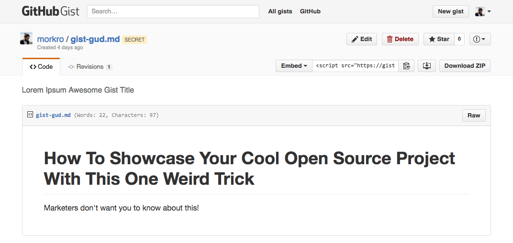

# Gist Word Count

Adds a word count to your files on GitHub Gist.

## Install
Install the extension via Chrome Web Store, or [download](https://github.com/morkro/chrome-gist-word-count/archive/master.zip) this repository and add it as unpacked Chrome extension.

### Supported languages:
- Markdown
- Text

Excludes Markdown code blocks which begin and end with three backtick characters.

## License :copyright:
The code is available under [MIT License](https://github.com/morkro/DOMtimer/blob/master/LICENSE).